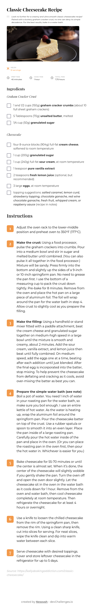
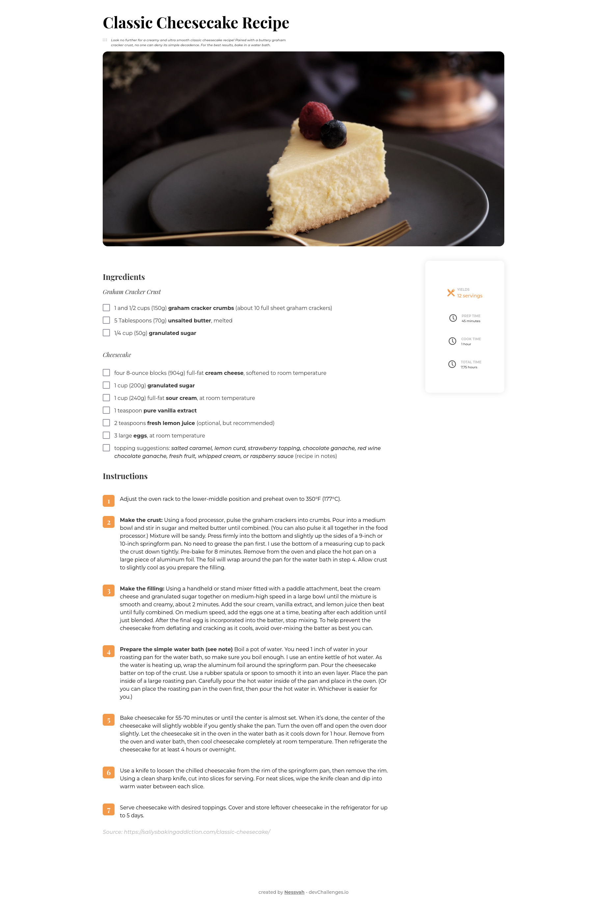

# Recipe Page

Solution for a challenge from [Devchallenges.io](http://devchallenges.io)

### [DEMO](https://nessvah-recipepage.netlify.app)

### [SOLUTION](https://github.com/Nessvah/Recipe-page)

### [CHALLENGE](https://devchallenges.io/challenges/OEKdUZ6xs0h99C38XVht)

<!-- TABLE OF CONTENTS -->

## Table of Contents

- [Recipe Page](#recipe-page)
    - [DEMO](#demo)
    - [SOLUTION](#solution)
    - [CHALLENGE](#challenge)
  - [Table of Contents](#table-of-contents)
  - [Overview](#overview)
    - [Built With](#built-with)
  - [Features](#features)
  - [Contact](#contact)

<!-- OVERVIEW -->

## Overview

- It was a really great opportunity to practice layouts with grid property.
- I also learned how we can costumise the list style from ordered and unordered lists.
- I can notice how easier it is becoming to do pages with html and css.

### Built With

<!-- This section should list any major frameworks that you built your project using. Here are a few examples.-->

- HTML
- CSS
- RESPONSIVE DESIGN
- FIGMA

## Features

<!-- List the features of your application or follow the template. Don't share the figma file here :) -->

This application/site was created as a submission to a [DevChallenges](https://devchallenges.io/challenges) challenge. The [challenge](https://devchallenges.io/challenges/TtUjDt19eIHxNQ4n5jps) was to build an application to complete the following user stories:

- [x] User story: I can see a recipe with ingredients and instructions
- [x] User story: I can select a checkbox if I have the ingredients
- [x] User story: I can see the number of servings, baking times

## Contact

- GitHub [@nessvah](https://github.com/nessvah})
- Twitter [@nessvah\_](https://twitter.com/nessvah_)
